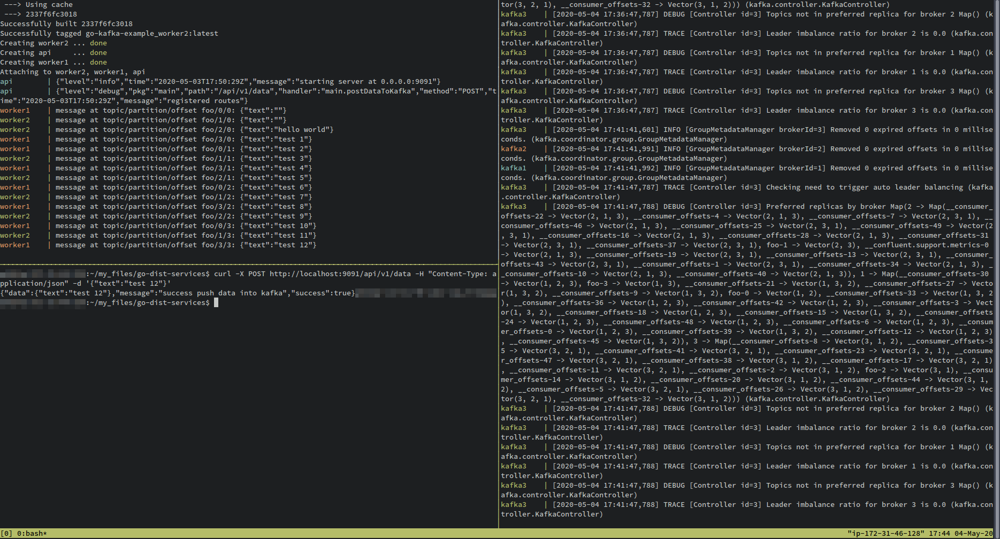

# REST API and Event Sourcing with Kafka

This is a skeleton project for a Go REST API service using Kafka for event sourcing.

<p align="center">
  
</p>

This has only been tested on Linux, and depends on Docker to build.

## Running Kafka

Start Kafka cluster with Docker Compose:

```
HOST_IP=your-ip docker-compose -f docker-compose-kafka.yml up
```

After that, create a Kafka topic "notification" using this command:

```
docker run --net=host --rm confluentinc/cp-kafka:5.0.0 kafka-topics --create --topic notification --partitions 4 --replication-factor 2 --if-not-exists --zookeeper localhost:32181
```

This will create the topic "notification" with 4 partitions and replication factors = 2.

## Building

Build and run Go application inside Docker.

You can try this project without installing Go, just run:

```
HOST_IP=your-ip docker-compose up --build
```

It will build and run the API and 2 worker inside Docker container.
